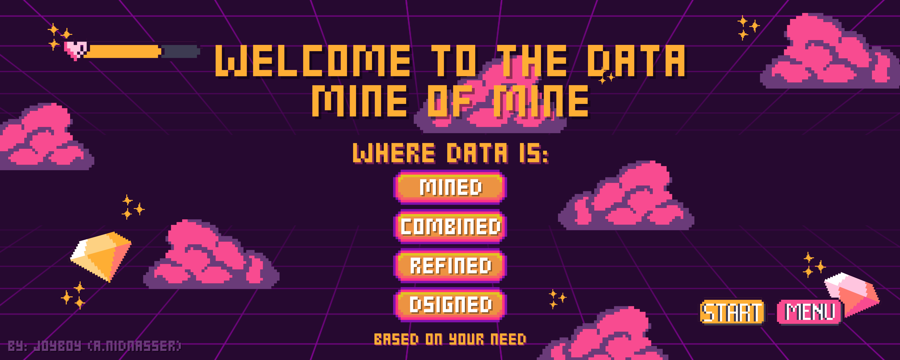

<!-- Title -->
<h3 align="center">I am NIDNASSER Abdelmajid (aka. JoyBoy). A Data Engineer on the Rise.</h3>

<!-- About me -->
### 📌 About me:

🔨 Passionate about building scalable data pipelines and infrastructure. 
📈 Leveraging data to drive strategic business decisions. 
☁️ Exploring cloud-based solutions for modern data challenges. 
🤖 Interested in applying machine learning and artificial intelligence to enhance data-driven insights. 
<!--
 -->

<!-- Social Media -->

     

<!-- Tech Stack -->

<!-- Visitors count -->

<!-- Repo Stats -->

<!-- Lang Stats -->

<!-- Streak -->

<!-- Trophies -->

<h2 align="center">👨‍💻 Repositories 👨‍💻</h2>
 

  

      

  
  

      

  
  

      

<h4 align="center">
  <a href="https://github.com/zumrudu-anka?tab=repositories" title="Show Repositories">🔎 Show More 🔍</a>
</h4>

 
<code></code>
<code></code>
<code></code>

<!-- HERE -->
<h2 align="left">Languages and Tools</h2>

<h4>Languages</h4>

 
 
 
 
 
 

<h4>Software Development </h4>

       
  
       
  
     
 
<h4>Data Stuff</h4> 

     
  
 

 

<h2 align="left">You can find me in</h2>

<a href="https://www.linkedin.com/in/taha-elghabi/" target="_blank"> 
<a href="https://www.kaggle.com/kobeerose" target="_blank"> 
<a href="https://www.datacamp.com/profile/tahaelghabi" target="_blank"> 
<a href="https://dev.to/kobeerose" target="_blank"> 

